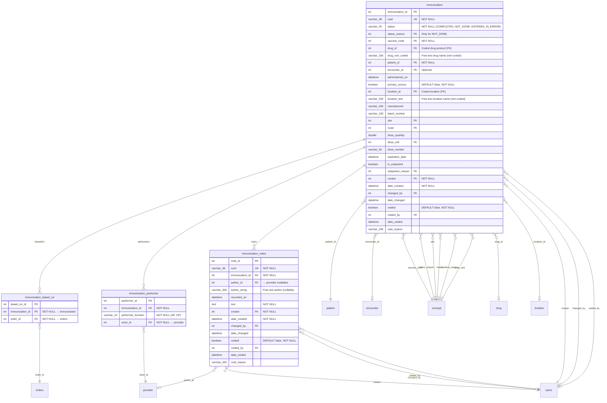

# Immunization Module - ER Diagram

```mermaid
erDiagram
    immunization {
        int immunization_id PK
        varchar_38 uuid UK "NOT NULL"
        varchar_20 status "NOT NULL (COMPLETED, NOT_DONE, ENTERED_IN_ERROR)"
        int status_reason FK "Only for NOT_DONE"
        int vaccine_code FK "NOT NULL"
        int drug_id FK "Coded drug product (FK)"
        varchar_255 drug_non_coded "Free text drug name (non-coded)"
        int patient_id FK "NOT NULL"
        int encounter_id FK "Optional"
        datetime administered_on
        boolean primary_source "DEFAULT false, NOT NULL"
        int location_id FK "Coded location (FK)"
        varchar_255 location_text "Free text location name (non-coded)"
        varchar_255 manufacturer
        varchar_100 batch_number
        int site FK
        int route FK
        double dose_quantity
        int dose_unit FK
        varchar_50 dose_number
        datetime expiration_date
        boolean is_subpotent
        int subpotent_reason FK
        int creator FK "NOT NULL"
        datetime date_created "NOT NULL"
        int changed_by FK
        datetime date_changed
        boolean voided "DEFAULT false, NOT NULL"
        int voided_by FK
        datetime date_voided
        varchar_255 void_reason
    }

    immunization_based_on {
        int based_on_id PK
        int immunization_id FK "NOT NULL → immunization"
        int order_id FK "NOT NULL → orders"
    }

    immunization_performer {
        int performer_id PK
        int immunization_id FK "NOT NULL"
        varchar_10 performer_function "NOT NULL (AP, OP)"
        int actor_id FK "NOT NULL → provider"
    }

    immunization_notes {
        int note_id PK
        varchar_38 uuid UK "NOT NULL"
        int immunization_id FK "NOT NULL"
        int author_id FK "→ provider (nullable)"
        varchar_255 author_string "Free text author (nullable)"
        datetime recorded_on
        text text "NOT NULL"
        int creator FK "NOT NULL"
        datetime date_created "NOT NULL"
        int changed_by FK
        datetime date_changed
        boolean voided "DEFAULT false, NOT NULL"
        int voided_by FK
        datetime date_voided
        varchar_255 void_reason
    }

    immunization ||--o{ immunization_based_on : "basedOn"
    immunization ||--o{ immunization_performer : "performers"
    immunization ||--o{ immunization_notes : "notes"
    immunization_based_on }o--|| orders : "order_id"
    immunization }o--|| patient : "patient_id"
    immunization }o--o| encounter : "encounter_id"
    immunization }o--|| concept : "vaccine_code"
    immunization }o--o| concept : "status_reason"
    immunization }o--o| concept : "site"
    immunization }o--o| concept : "route"
    immunization }o--o| concept : "subpotent_reason"
    immunization }o--o| concept : "dose_unit"
    immunization }o--o| drug : "drug_id"
    immunization }o--o| location : "location_id"
    immunization }o--|| users : "creator"
    immunization }o--o| users : "changed_by"
    immunization }o--o| users : "voided_by"
    immunization_performer }o--|| provider : "actor_id"
    immunization_notes }o--o| provider : "author_id"
    immunization_notes }o--|| users : "creator"
    immunization_notes }o--o| users : "changed_by"
    immunization_notes }o--o| users : "voided_by"
```
